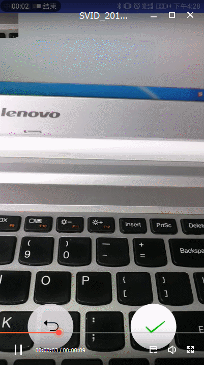

#### ChangeButton

  提供取消跟确认状态按钮 高仿微信朋友圈相机拍照按钮效果

#### 功能介绍

 话不多说 看图
 
 <a href="art/GIF.gif"></a>
 
#### 引入项目

```groovy

    allprojects {
    		repositories {
    			...
    			maven { url 'https://jitpack.io' }
    		}
    	}
```

```groovy
    dependencies {
	        compile 'com.github.xiangdingquan:ChangeButton:1.0.0'
	}
```

#### 布局中添加控件

```xml
    <org.xdq.library.ChanggeButtonLayout
        android:id="@+id/one"
        android:layout_width="match_parent"
        android:layout_height="wrap_content">
    </org.xdq.library.ChanggeButtonLayout>
```

#### activity给确认View的监听

```java
    buttonLayout.setSeparateClickListener(new SeparateClickListener() {
                @Override
                public void onCancle() {
                    Toast.makeText(getApplicationContext(), "取消", Toast.LENGTH_SHORT).show();
                }
    
                @Override
                public void onConfirm() {
                    Toast.makeText(getApplicationContext(), "确认", Toast.LENGTH_SHORT).show();
                }
            });

```

#### 给中间按钮的监听

```java

     buttonLayout.setCenterClickListener(new CenterClickListener() {
                @Override
                public void click() {
                    Toast.makeText(getApplicationContext(), "执行任务", Toast.LENGTH_SHORT).show();
                }
            });
```


  
#### About me
An android developer in WuHan


